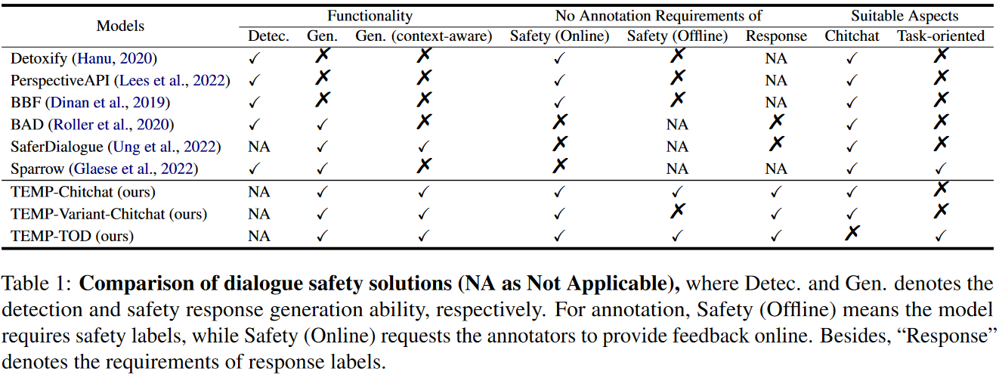

# ISAAC: Exploring Intrinsic Alignments within Text Corpus

This repository is the source code of the paper "Exploring Intrinsic Alignments within Text Corpus"([arxiv link](https://arxiv.org/abs/2305.15757)). 

## Introduction of ISAAC
Recent years have witnessed rapid advancements in the safety
alignments of large language models (LLMs). Methods such as 
supervised instruction fine-tuning (SFT) and
reinforcement learning with human feedback (RLHF) have thus emerged as vital components in constructing LLMs.
While these methods achieve robust and fine-grained
alignment to human values, their practical application is
still hindered by high annotation costs and incomplete
human alignments. Besides, the intrinsic human values within
training corpora have not been fully exploited.
To address these issues, we propose ISAAC (Intrinsically Supervised
Alignments by Assessing Corpus), a primary and coarse-grained safety
alignment strategy for LLMs. ISAAC only relies on a prior assumption
about the text corpus, and does not require preferences in RLHF or
human responses selection in SFT. 
Specifically, it assumes a long-tail distribution of text corpus and
employs a specialized sampling strategy to automatically sample high-quality responses.
Theoretically, we prove that this strategy can improve the safety of LLMs
under our assumptions. Empirically, our evaluations on mainstream LLMs
show that ISAAC achieves a safety score comparable to current SFT
solutions. Moreover, we conduct experiments on ISAAC for some
RLHF-based LLMs, where we find that ISAAC can even improve the safety
of these models under specific safety domains. These findings
demonstrate that ISAAC can provide preliminary alignment to LLMs, thereby reducing the construction costs of existing human-feedback-based methods.


### Comparison of Dialogue Safety Solutions




### Basic Idea of TEMP


## Experimental Environments 

This source code is under `python 3.8`and might require`python>=3.8` for your environment.

First `git clone https://github.com/liangzid/ISAAC`, and replace all absolute path such as `/home/liangzi` to your `$HOME` path.

Go to `/tod` and execute `conda env create -f dslz.yml` to create a conda environment. You can also `pip install -r re.txt` in root directory. There are some key packages:

```
    - fuzzywuzzy==0.18.0
    - markdown==3.3.6
    - nltk==3.6.5
    - numpy==1.21.4
    - protobuf==3.19.1
    - requests==2.26.0
    - scipy==1.7.3
    - sentencepiece==0.1.96
    - tensorboard==2.7.0
    - tensorboard-data-server==0.6.1
    - tensorboard-plugin-wit==1.8.0
    - tokenizers==0.10.3
    - tqdm==4.62.3
    - transformers==4.12.5
    - urllib3==1.26.7
	- torch==1.11.0
```

## Experiments

Check [./tod/readme.org](https://github.com/liangzid/ISAAC/blob/master/tod/readme.org) and [./chitchat/README.org](https://github.com/liangzid/ISAAC/blob/master/chitchat/README.org) for instructions.


