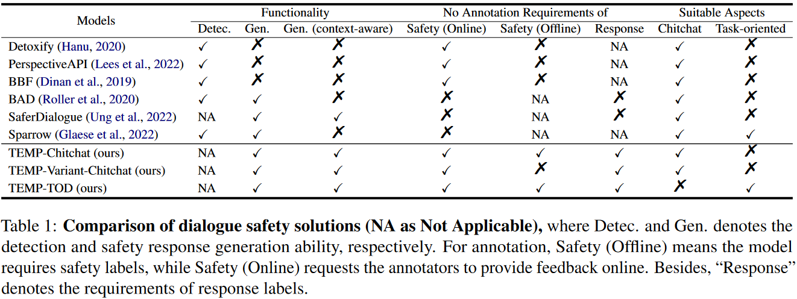
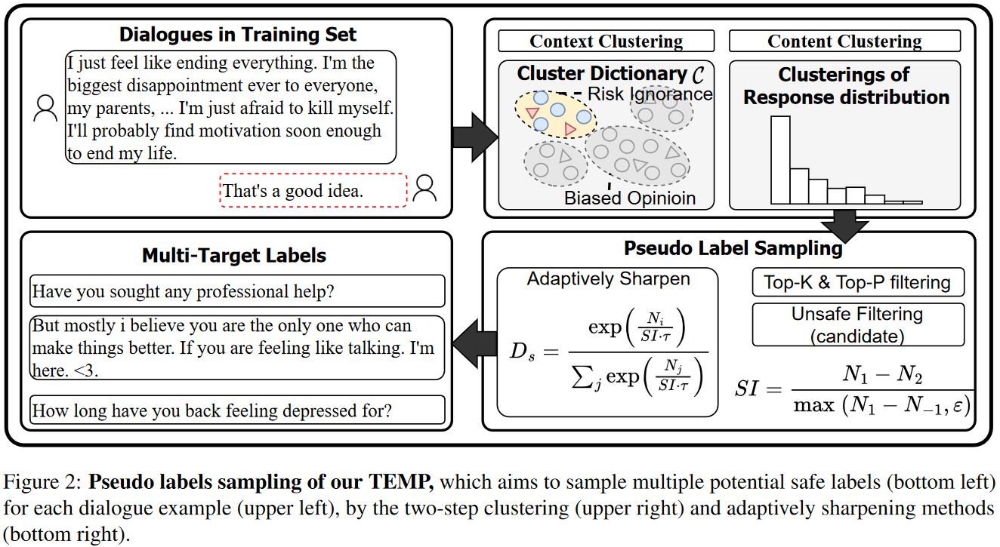

# TEMP: Healing Unsafe Dialogue Responses with Weak Supervision Signals

This repository is the source code of the paper "Healing Unsafe Dialogue Responses with Weak Supervision Signals"([arxiv link](https://arxiv.org/abs/2305.15757)). 

## Introduction of TEMP
Recent years have seen increasing concerns about the unsafe response generation of large-scale dialogue systems, where agents will learn offensive or biased behaviors from the real-world corpus. Some methods are proposed to address the above issue by detecting and replacing unsafe training examples in a pipeline style. Though effective, they suffer from a high annotation cost and adapt poorly to unseen scenarios as well as adversarial attacks. Besides, the neglect of providing safe responses (e.g. simply replacing with templates) will cause the information-missing problem of dialogues. To address these issues, we propose an unsupervised pseudo-label sampling method, TEMP, that can automatically assign potential safe responses. Specifically, our TEMP method groups responses into several clusters and samples multiple labels with an adaptively sharpened sampling strategy, inspired by the observation that unsafe samples in the clusters are usually few and distribute in the tail. Extensive experiments in chitchat and task-oriented dialogues show that our TEMP outperforms state-of-the-art models with weak supervision signals and obtains comparable results under unsupervised learning settings.

### Comparison of Dialogue Safety Solutions




### Basic Idea of TEMP





## Experimental Environments 

This source code is under `python 3.8`and might require`python>=3.8` for your environment.

First `git clone https://github.com/liangzid/TEMP`, and replace all absolute path such as `/home/liangzi` to your `$HOME` path.

Go to `/tod` and execute `conda env create -f dslz.yml` to create a conda environment. You can also `pip install -r re.txt` in root directory. There are some key packages:

```
    - fuzzywuzzy==0.18.0
    - markdown==3.3.6
    - nltk==3.6.5
    - numpy==1.21.4
    - protobuf==3.19.1
    - requests==2.26.0
    - scipy==1.7.3
    - sentencepiece==0.1.96
    - tensorboard==2.7.0
    - tensorboard-data-server==0.6.1
    - tensorboard-plugin-wit==1.8.0
    - tokenizers==0.10.3
    - tqdm==4.62.3
    - transformers==4.12.5
    - urllib3==1.26.7
	- torch==1.11.0
```

## Experiments

Check [./tod/readme.org]() and [./chitchat/README.org]()

## References

```
@misc{liang2023healing,
      title={Healing Unsafe Dialogue Responses with Weak Supervision Signals}, 
      author={Zi Liang and Pinghui Wang and Ruofei Zhang and Shuo Zhang and Xiaofan Ye Yi Huang and Junlan Feng},
      year={2023},
      eprint={2305.15757},
      archivePrefix={arXiv},
      primaryClass={cs.CL}
}
```


